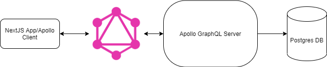

# Vehicle Query Site


## Overview 
The application allows users to search for vehicles from a  database, either by a specific value that is entered in a search, or by filtering through the different types of vehicles and there options. 


## Overall Architecture 
This site uses 3 main components
- Postgresql Database
- Apollo Server Backend for GraphQL
- Nextjs Frontend Application  





### Postgres
Database is handed with a docker image where on init it will create the tables and prefill the data using the util/init_db.sh script. For testing purposes the database just uses default names and passwords, but this can be configured in the dockercompose file. 


### Apollo Server
The server is located in the backend folder and allows the use of graphql to query the postgres. In order to fetch data from the database in the resolvers, prisma is used, which allows for easy ORM type queries.


The reason to with it was mainly the ease of use to developing on it, especially using the apollo studio to test queries and connections to the database.


### Nextjs Frontend
Basic frontend with 3 main pages
- Home page ('/')
    - This page shows the search bar and has some selector options for different types of vehicles to view
- Vehicles List ('/vehicles /type')
    - This will show a list of vehicles in the database organized by type. There are also filters where users can refine their search. The filters are also dynamic so they adjust there available options as filters are selected.
- Vehicle Model View ('/vehicle/type/model')
    - This page shows all the information about a selected vehicle


## Running the application


Everything is built inside of a docker-compose using docker files for the individual services. 


To run everything, the command ```docker-compose up``` in the main directory will start the application.


- For the frontend, it can be accessed at http://localhost:3000
- For the apollo server tool, it can be accessed at http://localhost:4000
